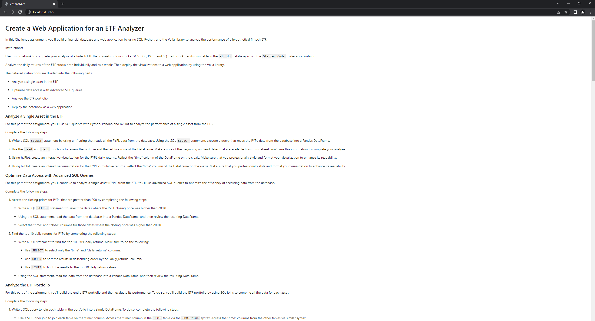
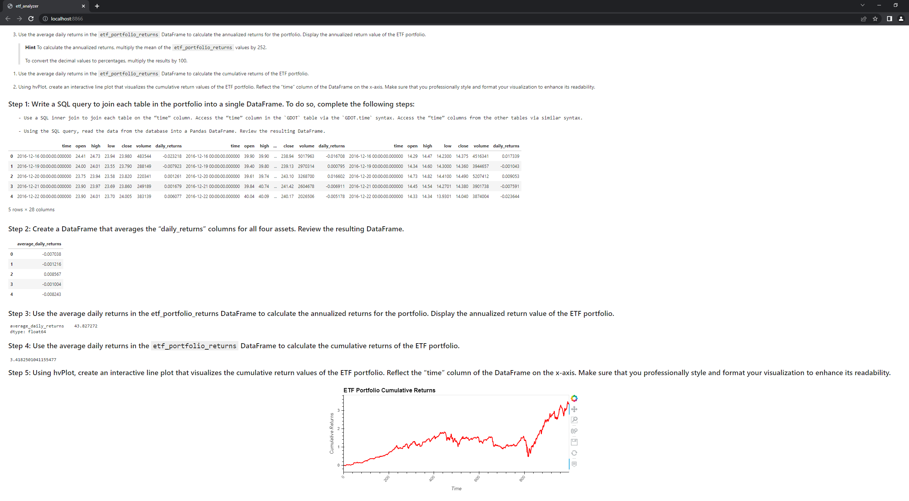

# Bootcamp_Week_7


# ETF Analyzer

This program is designed to build a financial database and web application by using SQL, Python, and the Voilà library to analyze the performance of a hypothetical fintech ETF.

For additional reference, our Voila images are within the Images sub-folder, as well as below.


---

---

## Technologies

Within this program, we will make use of the following external python modules:
  -- pandas
  -- numpy
  -- hvplot
  -- sqlalchemy
  
  Additionally, this program was created within a python v3.7 build, and its relevant dependencies.

---

## Installation Guide

To utilize this program, within your terminal you will have to install the required libraries. Within your terminal, input the following commands:

```python
pip install pandas
```

```python
pip install numpy
```

```python
pip install hvplot
```

```python
pip install sqlalchemy
```

At the beginning of the *etf_analyzer.ipynb* file, the technologies are calling in with this code:

```
import numpy as np
import pandas as pd
import hvplot.pandas
import sqlalchemy
```

---

## Usage

To operate this program, open up your terminal of choice and navigate to the directory in which you have downloaded the files within this repository. Open Jupyter Lab with the command: 

```python
jupyter lab
```  

This should open jupyter lab to the filepath in which you have the repo file, and you simply need double click the *etf_analyzer.ipynb* file to open it. Upon opening, select the menu button with two right facing arrows at the top of the notebook, which will run the entire file. It will ask you to confirm you wish to restart the file, to which you will confirm. Wait a few moments for the program to operate as intended, and peruse the resulting data at your leisure. If you wish, simply skip to the end for my analysis of the preceding information. 

---

## Contributors

Colton Mayes ctmayes@gmail.com

---

## License

This code is created for educational purposes, and it usage therein has no commerical application. It is designated as free-use thusly, and shall remain as such.
